**Advanced Lane Finding Project**

The goals / steps of this project are the following:

* Compute the camera calibration matrix and distortion coefficients given a set of chessboard images.
* Apply a distortion correction to raw images.
* Use color transforms, gradients, etc., to create a thresholded binary image.
* Apply a perspective transform to rectify binary image ("birds-eye view").
* Detect lane pixels and fit to find the lane boundary.
* Determine the curvature of the lane and vehicle position with respect to center.
* Warp the detected lane boundaries back onto the original image.
* Output visual display of the lane boundaries and numerical estimation of lane curvature and vehicle position.

[//]: # (Image References)

[image1]: ./output_images/original_image.png "Original Chessboard"
[image2]: ./output_images/undistorted_image.jpg "Undistorted Image"
[image3]: ./examples/binary_combo_example.jpg "Binary Example"
[image4]: ./examples/warped_straight_lines.jpg "Warp Example"
[image5]: ./examples/color_fit_lines.jpg "Fit Visual"
[image6]: ./examples/example_output.jpg "Output"
[video1]: ./project_video.mp4 "Video"

## [Rubric](https://review.udacity.com/#!/rubrics/571/view) Points

### Camera Calibration

I start by preparing "object points", which will be the (x, y, z) coordinates of the chessboard corners in the world. Here I am assuming the chessboard is fixed on the (x, y) plane at z=0, such that the object points are the same for each calibration image.  Thus, `objp` is just a replicated array of coordinates, and `objpoints` will be appended with a copy of it every time I successfully detect all chessboard corners in a test image.  `imgpoints` will be appended with the (x, y) pixel position of each of the corners in the image plane with each successful chessboard detection.  

I then used the output `objpoints` and `imgpoints` to compute the camera calibration and distortion coefficients using the `cv2.calibrateCamera()` function.  I applied this distortion correction to the test image using the `cv2.undistort()` function and obtained this result: 

Note: The code can be found in [camera_calibration.py](camera_calibration.py)
<table style="width:100%">
  <tr>
    <th>
      <p align="center">
           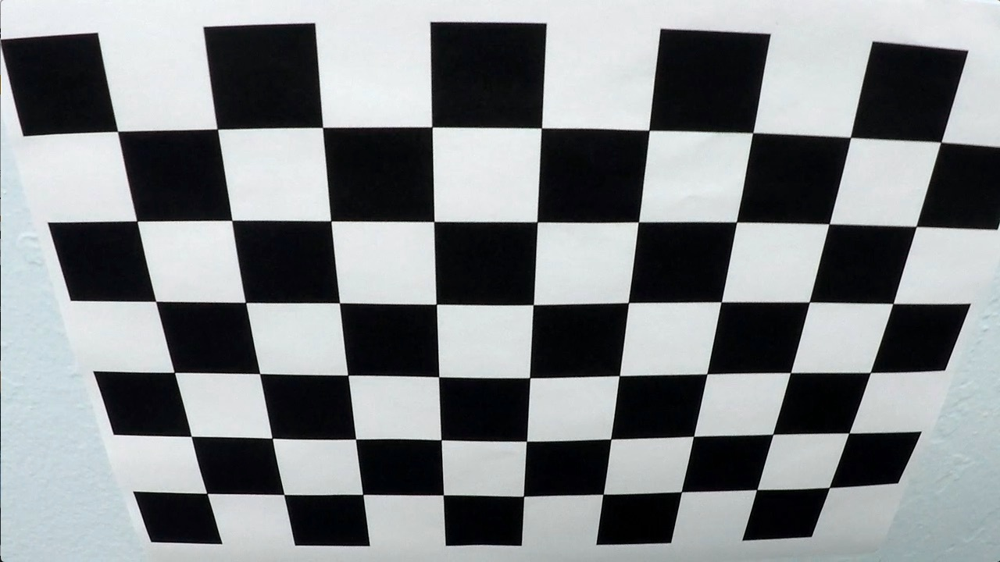
           <br>Original Chessboard
      </p>
    </th>
    <th>
      <p align="center">
           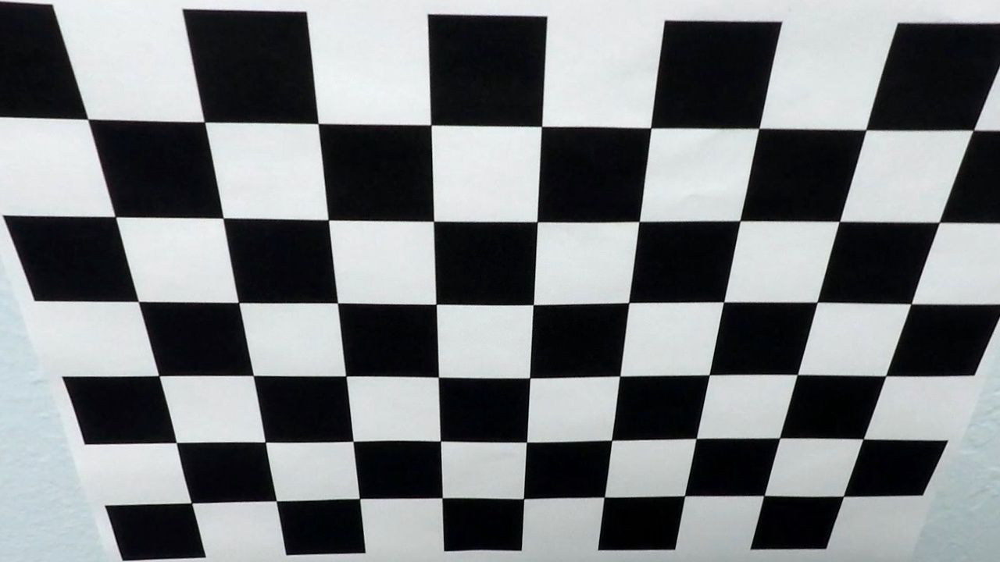
           <br>Undistorted Chessboard
      </p>
    </th>
  </tr>
</table>

### Pipeline (single images)

#### 1. Provide an example of a distortion-corrected image.
After camera calibration, some test images could be used for experiment. The following images show the original test image and the image after calibration and undistortion.

<table style="width:100%">
  <tr>
    <th>
      <p align="center">
           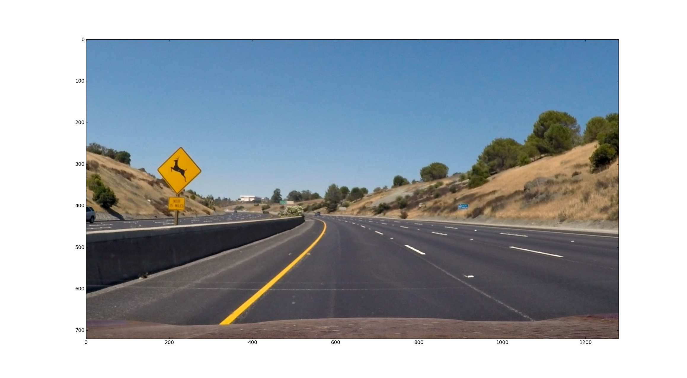
           <br>Original Test Image
      </p>
    </th>
    <th>
      <p align="center">
           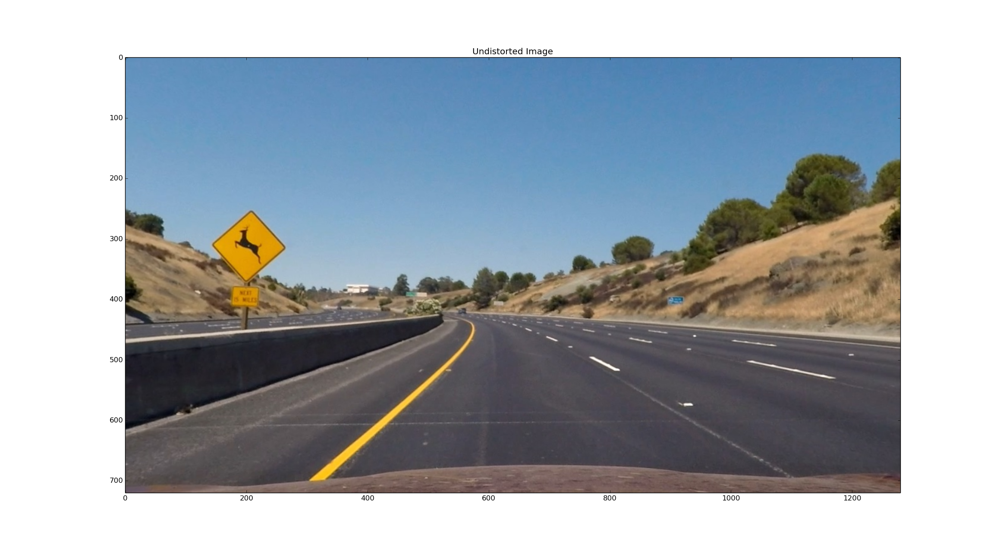
           <br>Undistorted Test Image
      </p>
    </th>
  </tr>
</table>

#### 2. Describe how (and identify where in your code) you used color transforms, gradients or other methods to create a thresholded binary image.  Provide an example of a binary image result.

The code can be found in [image_binarization.py](image_binarization.py)

The sobel operator is applied to calculate the gradient in the x or the y direction. The following figures show the original image and after gradient taken in x direction.

<table style="width:100%">
  <tr>
    <th>
      <p align="center">
           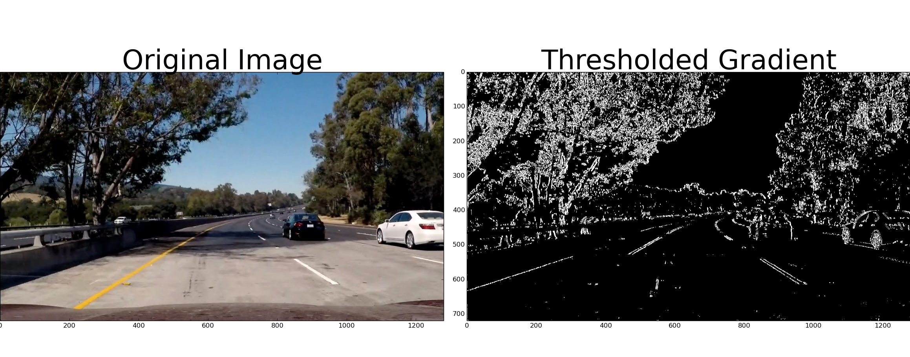
           <br>The binary image using X-gradient
      </p>
    </th>
  </tr>
</table>

However, the yellow lane cannot be detected successfully. 
Then I tried to convert the image HLS color space.

<table style="width:100%">
  <tr>
    <th>
      <p align="center">
           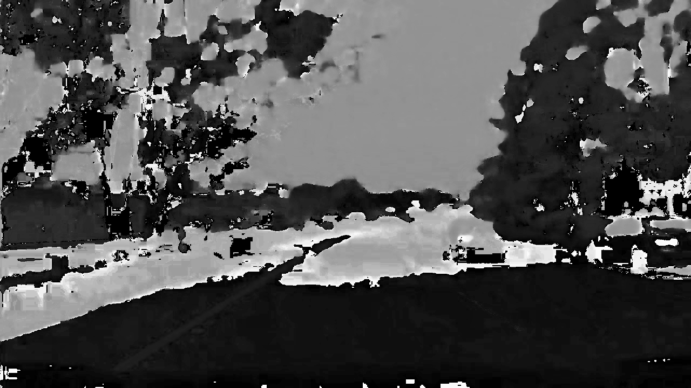
           <br>H
      </p>
    </th>
    <th>
      <p align="center">
           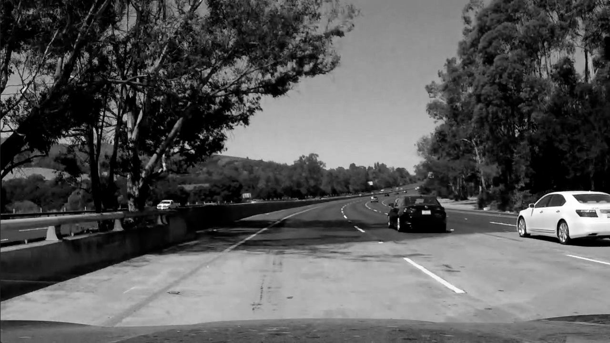
           <br>L
      </p>
    </th>
    <th>
      <p align="center">
           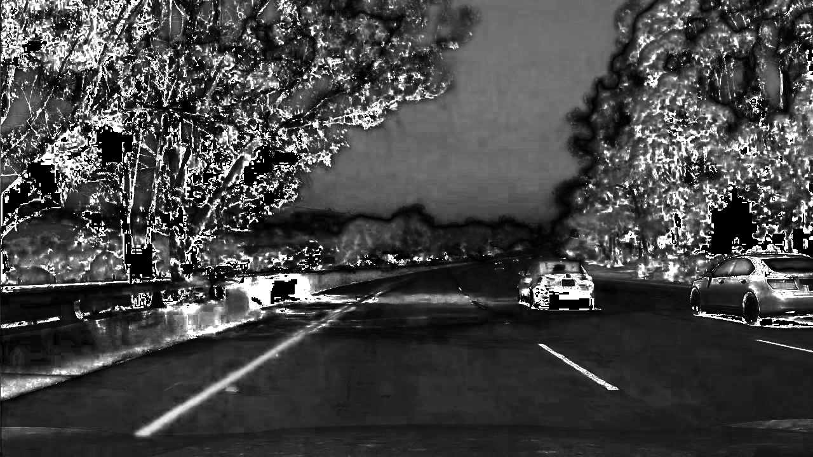
           <br>S
      </p>
    </th>
  </tr>
</table>

Then a threshold is applied on the S channel. And finally combine the S channel and gradient(x direction) thresholding.


<table style="width:100%">
  <tr>
    <th>
      <p align="center">
           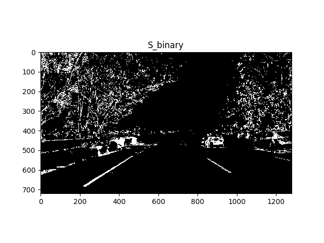
           <br>S_binary
      </p>
    </th>
    <th>
      <p align="center">
           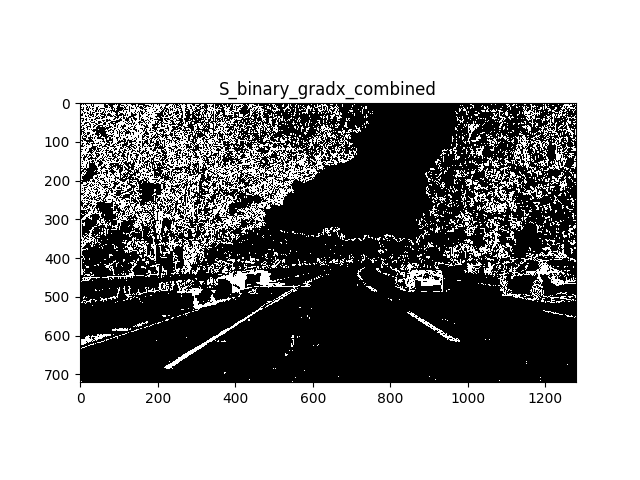
           <br>Combined Result
      </p>
    </th>
  </tr>
</table>

Optional step is to apply a morphology function to fullfill the white points, this will improve the performance.

<table style="width:100%">
  <tr>
    <th>
      <p align="center">
           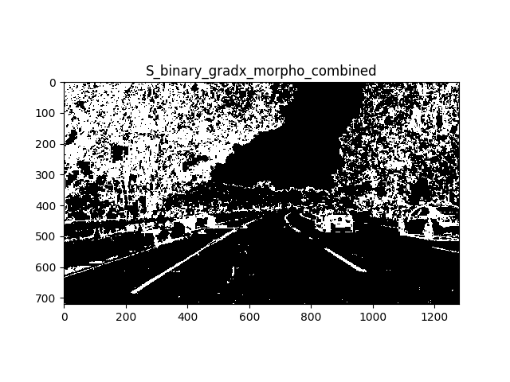
           <br>After Morphology
      </p>
    </th>
  </tr>
</table>


#### 3. Describe how (and identify where in your code) you performed a perspective transform and provide an example of a transformed image.

The perspective transform code can be found in [perspective_transform.py](perspective_transform.py)
I chose the hardcode the source and destination points in the following manner:

```python
    src = np.float32([[1065, 684],
                      [255, 684],
                      [603, 443],
                      [678, 443]])
    dst = np.float32([[w*4/5, h],
                      [w/5, h],
                      [w/5, 0],
                      [w*4/5, 0]])
```

This resulted in the following source and destination points:

| Source        | Destination   | 
|:-------------:|:-------------:| 
| 1065, 684      | 1024, 720        | 
| 255, 684      | 256, 720      |
| 603, 443     | 256, 0      |
| 678, 443      | 1024, 0        |

I verified that my perspective transform was working as expected by drawing the `src` and `dst` points onto a test image and its warped counterpart to verify that the lines appear parallel in the warped image.
<table style="width:100%">
  <tr>
    <th>
      <p align="center">
           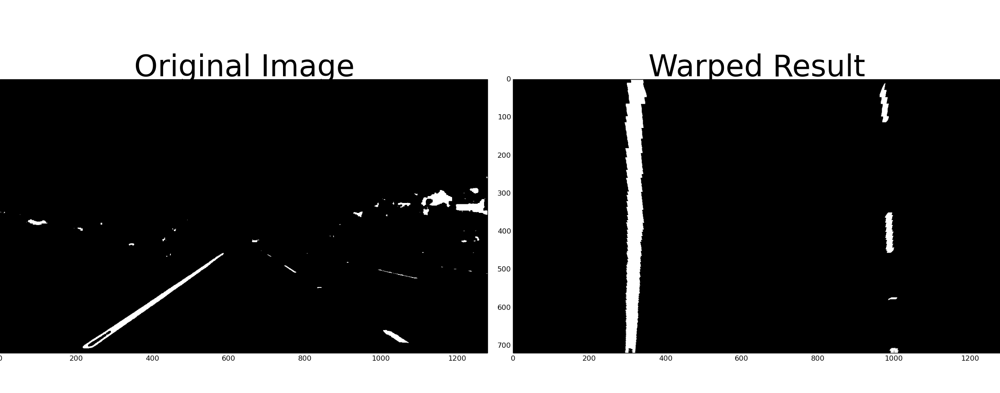
           <br>Perspective Transform
      </p>
    </th>
  </tr>
</table>

#### 4. Describe how (and identify where in your code) you identified lane-line pixels and fit their positions with a polynomial?

The code for lane-line finding can be found in [line_find.py](line_find.py)
Since a threshold warped image is provided, we can use it to detect lane-line pixels.
<table style="width:100%">
  <tr>
    <th>
      <p align="center">
           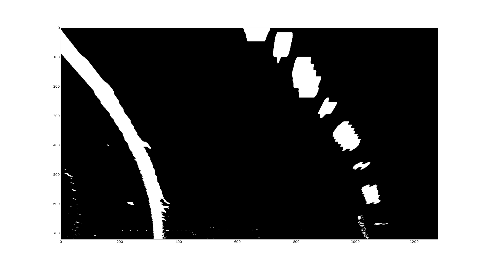
           <br>Warped Binary Image
      </p>
    </th>
  </tr>
  <tr>
    <th>
      <p align="center">
           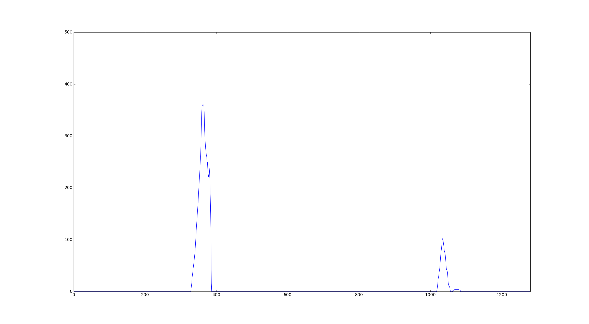
           <br>Histogram
      </p>
    </th>
  </tr>
</table>

As shown above, a histogram is taken along all the columns in the lower half of the image. The most prominent peaks in this histogram will be good indicators of the X-position of the base of the lane lines.

Then implement sliding windows search method to detect lane-lines. The result is like this:
<table style="width:100%">
  <tr>
    <th>
      <p align="center">
           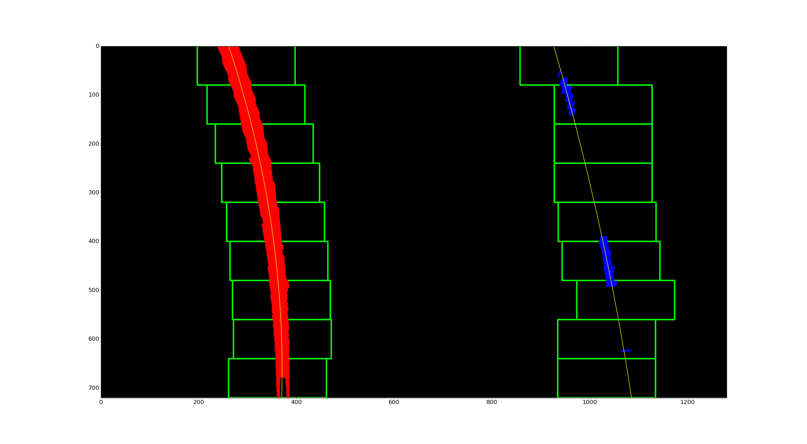
           <br>Sliding Windows Search
      </p>
    </th>
  </tr>
</table>

If we have detected the lane-lines from the previous frame, then we can skip this step and search in a margin around the previous line position. More details in [line_find.py](line_find.py)
#### 5. Describe how (and identify where in your code) you calculated the radius of curvature of the lane and the position of the vehicle with respect to center.
I calculate the the radius of curvature and the vehicle position offset as follows:
```
def curvature(line_left, line_right, frame):
    y_eval = frame.shape[0]/2
    [A_left, B_left,_] = np.mean(line_left.recent_fits_meter, axis=0)
    R_left = ((1 + (2 * A_left * y_eval + B_left) ** 2) ** 1.5) / np.absolute(2 * A_left)
    [A_right, B_right,_] = np.mean(line_right.recent_fits_meter, axis=0)
    R_right = ((1 + (2 * A_right * y_eval + B_right) ** 2) ** 1.5) / np.absolute(2 * A_right)
    R_mean = np.mean([R_left, R_right])
    return R_left, R_right, R_mean

def vehicle_position(line_left, line_right, frame):
    w = frame.shape[1]
    # calculate the distance between two lines
    if line_right.detected and line_left.detected:
        left_bottom = np.mean(line_left.all_x[line_left.all_y > 0.95 * line_left.all_y.max()])
        right_bottom = np.mean(line_right.all_x[line_right.all_y > 0.95 * line_right.all_y.max()])
        width = right_bottom - left_bottom
        position_offset = left_bottom + width/2 - frame.shape[1]/2
        position_offset *= 3.7/700.

    return position_offset

```
Note: the output should be in meter.

#### 6. Provide an example image of your result plotted back down onto the road such that the lane area is identified clearly.

Finally project the final result onto the road.

<table style="width:100%">
  <tr>
    <th>
      <p align="center">
           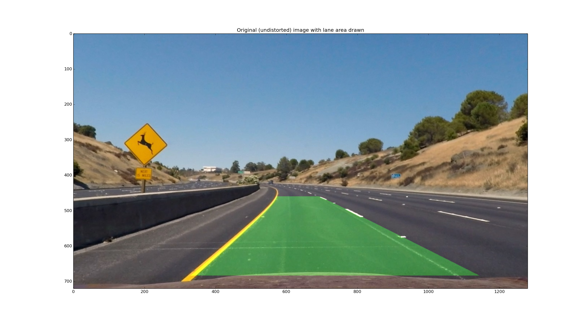
           <br>Original(undistorted) Image with Lane Area drawn
      </p>
    </th>
  </tr>
</table>
---

### Pipeline (video)

#### 1. Provide a link to your final video output.  Your pipeline should perform reasonably well on the entire project video (wobbly lines are ok but no catastrophic failures that would cause the car to drive off the road!).

<p align="center">
</a>
 <br>Final Gif Result. 
</p>


Here's a [link to my video result](./out_video.mp4)

---

### Discussion

#### 1. Briefly discuss any problems / issues you faced in your implementation of this project.  Where will your pipeline likely fail?  What could you do to make it more robust?

I realized one situation that the lane-lines cannot be detected as expected is when there are some shadows and the line is sparse at the same time. In such a case, maybe we could maintain the result from the previous frames since the lane curvature doesn't change strongly.
